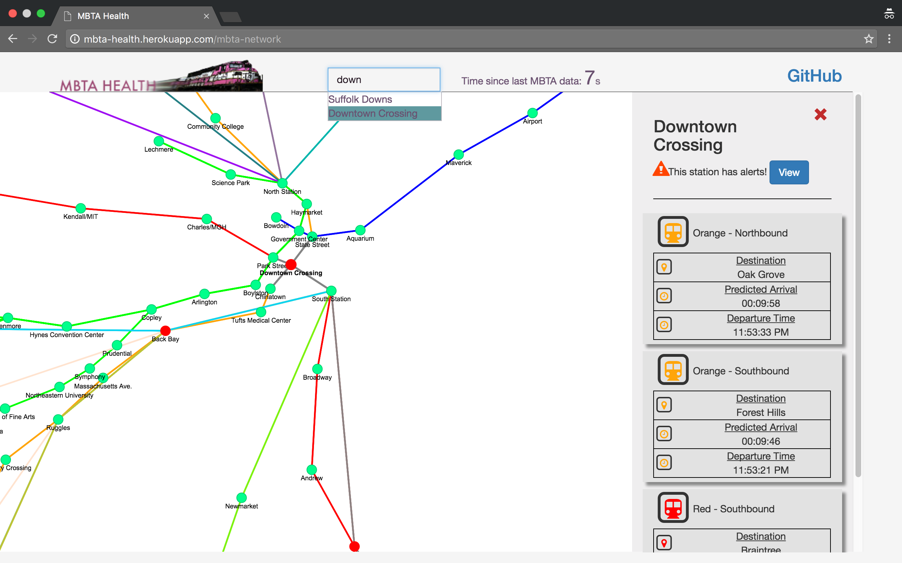

# MBTA_Health

## ( very much work in progress )

### http://mbta-health.herokuapp.com/


##todo
* add in details(schedule/alerts) pane for stations/routes when one is selected.
* update station nodes color in realtime depending if trains are running on time or not.

## Installation
!! You need an API key from the MBTA in order to seed this project.
Place it inside .env ```MBTA_KEY=<your key>```
```
cd MBTA_Health
bundle install
rails db:create
rails db:migrate
rails db:seed
```
```
cd client
npm install
ng build
rails s
```